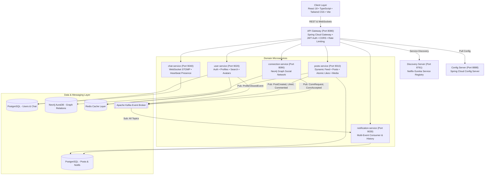

# Nexora — Enterprise Distributed Social & Professional Networking Platform

<p align="center">
  
  
  
  
  
  
  
  
  
  
</p>

---

## 📌 Executive Overview

**Nexora** is a production-grade, highly scalable distributed professional networking platform built with a modern **Event-Driven Microservices Architecture**. Designed to handle high-throughput social feeds, real-time bidirectional messaging, graph-based relationship queries, and asynchronous event streams, Nexora showcases enterprise engineering best practices across backend distributed systems and modern frontend user experiences.

---

## 🏛️ System Architecture



---

## ⚡ Core Engineering Highlights & Technical Decisions

### 1. 📬 Event-Driven Architecture with Apache Kafka
* **Decoupled Asynchronous Processing**: Post interactions (creation, likes, comments, connection requests, profile views) publish lightweight domain events to dedicated Kafka topics.
* **Non-Blocking User Experience**: HTTP request-response cycles complete in `< 25ms`, while multi-subscriber notification fan-outs and side effects execute asynchronously via background consumer groups with `ErrorHandlingDeserializer`.

### 2. 🕸️ Graph Database for Social Relationships (Neo4j)
* **Bidirectional 1st-Degree Traversal**: High-performance Cypher queries compute relationship graphs (`(p:Person)-[:CONNECTED_TO]-(c:Person)`) in logarithmic time rather than expensive multi-table SQL self-joins.
* **Cloud AuraDB Integration**: Production connection pool configured with secure bolt protocol (`neo4j+s://`).

### 3. 🛡️ Multi-Layer Security & Identity Header Sanitization
* **HS384 JWT Token Pair**: Long-lived access and refresh token pair with cryptographic claim validation (`type: ACCESS`).
* **Header Spoofing Prevention**: The API Gateway strictly strips any incoming `X-User-Id` headers from external clients before injecting verified user identities downstream.
* **BCrypt Hashing**: Zero plain-text password persistence; salted BCrypt cryptographic password storage.

### 4. 🔄 Dynamic Intelligent Feed with Connection Prioritization
* **Cold-Start Resilience**: Brand new users with 0 connections receive platform-wide community posts in reverse chronological order (**the feed is never empty**).
* **Network-First Ranking**: For connected users, posts from 1st-degree connections and self are prioritized at the top of the feed stream, followed by broader community insights.

### 5. 🛡️ Resilience & Circuit Breakers (Resilience4j)
* Inter-service Feign calls are protected by Resilience4j circuit breakers with sliding window failure thresholds and automatic half-open state transitions to ensure graceful degradation during downstream service latency.

### 6. 💬 Real-Time STOMP WebSockets & Online Presence Engine
* Bi-directional direct messaging via STOMP protocol over WebSocket (`/ws-chat`).
* Dynamic online presence tracking with periodic heartbeat timestamps (`Active now` vs `Offline` pulse indicators).

### 7. 📁 50MB High-Resolution Media Storage Pipeline
* Multipart file upload streaming for post attachments and profile avatars with image MIME validation, UUID-safe disk paths, and public streaming routes.

---

## 📦 Microservices Topology

| Service | Port | Primary Tech Stack | Database / Broker | Key Responsibilities |
| :--- | :--- | :--- | :--- | :--- |
| **`api-gateway`** | `8080` | Spring Cloud Gateway, WebFlux, JWT | — | Routing, AuthFilter token validation, CORS, WebSocket proxy |
| **`discovery-server`** | `8761` | Netflix Eureka Server | — | Dynamic service registration and heartbeat health checks |
| **`config-server`** | `8888` | Spring Cloud Config | Git / Local Repo | Centralized cloud environment configuration repository |
| **`user-service`** | `9020` | Spring Boot, Spring Data JPA, Redis | PostgreSQL + Redis | Authentication, profiles, member search, avatar uploads |
| **`posts-service`** | `9010` | Spring Boot, OpenFeign, Kafka, Redis | PostgreSQL + Redis | Feed ranking, CRUD posts, atomic like toggle, comments, media |
| **`connection-service`**| `8090` | Spring Data Neo4j, OpenFeign, Kafka | Neo4j AuraDB | Social graph, 1st-degree circle, connection requests |
| **`notification-service`**| `9030` | Spring Kafka, Spring Data JPA | PostgreSQL | Multi-event Kafka consumer, notification feeds, unread badges |
| **`chat-service`** | `9040` | Spring WebSocket, STOMP, JPA | PostgreSQL | Real-time chat messaging, history, active presence tracking |
| **`frontend`** | `3000` | React 18, TypeScript, Tailwind, Vite | — | Modern responsive Single Page App (SPA) with Dark Mode |

---

## 🚀 Quick Start & Local Execution

### Prerequisites
* **Java 21** (JDK)
* **Node.js 20+** & **npm**
* **Docker & Docker Compose** (Optional for containerized run)
* **Apache Kafka** & **Redis** running locally (or via Docker)

### Option A: 1-Click Containerized Startup (Recommended)

```bash
# 1. Clone repository
git clone https://github.com/<your-username>/nexora.git
cd nexora

# 2. Configure environment (optional)
cp .env.production.example .env

# 3. Launch the entire distributed ecosystem
docker compose -f docker-compose.prod.yml up -d --build
```
* **Frontend Web App**: http://localhost:3000
* **API Gateway**: http://localhost:8080
* **Eureka Discovery Dashboard**: http://localhost:8761
* **Zipkin Distributed Tracing**: http://localhost:9411

---

### Option B: Local Development Run (Day-to-Day Coding)

#### 1. Start Infrastructure & Core Discovery
```bash
# Terminal 1: Discovery Server
cd discovery-server && mvn spring-boot:run

# Terminal 2: Config Server
cd config-server && mvn spring-boot:run

# Terminal 3: API Gateway
cd api-gateway && mvn spring-boot:run
```

#### 2. Start Domain Microservices
```bash
cd user-service && mvn spring-boot:run
cd posts-service && mvn spring-boot:run
cd connection-service && mvn spring-boot:run
cd notification-service && mvn spring-boot:run
cd chat-service && mvn spring-boot:run
```

#### 3. Start Frontend SPA
```bash
cd frontend
npm install
npm run dev
```
Open **http://localhost:3000** in your browser.

---

## 🧪 Testing & Quality Assurance

```bash
# Run Frontend Linting and TypeScript Type Checking
cd frontend && npm run lint

# Run Backend Tests across all Microservices
cd posts-service && mvn test
cd user-service && mvn test
cd connection-service && mvn test
cd notification-service && mvn test
cd chat-service && mvn test
```

---

## 🤖 CI/CD Automation (GitHub Actions)

The repository includes an enterprise **GitHub Actions Pipeline** ([`.github/workflows/ci-cd.yml`](.github/workflows/ci-cd.yml)) that triggers on every push and pull request:
1. **Frontend Job**: Verifies TypeScript definitions, ESLint rules, and builds the production Vite bundle.
2. **Backend Matrix Job**: Concurrently compiles, packages, and executes unit tests for all **8 microservices** using Java 21 Temurin.
3. **Docker Validation Job**: Validates `docker-compose.prod.yml` configuration and tests container buildx images.

---

## 📄 License & Author

* **Author**: Abhinav Gupta
* **Architecture**: Distributed Cloud Microservices
* **License**: MIT License
