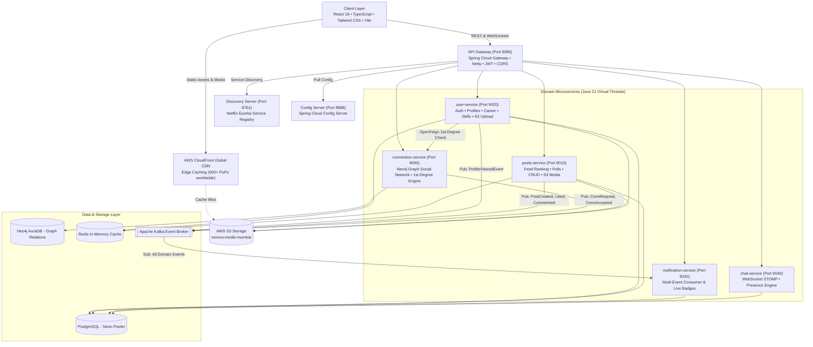

# Nexora — Enterprise Distributed Social & Professional Networking Platform

<p align="center">
  <a href="https://nexoranetwork.site"></a>
  
  
  
  
  
  
  
  
  
  
</p>

---

## 📌 Executive Overview

**Nexora** ([https://nexoranetwork.site](https://nexoranetwork.site)) is an enterprise-grade, high-concurrency distributed social and professional networking platform designed for modern software engineers, tech professionals, and creators. Built on an **Event-Driven Microservices Architecture**, Nexora delivers real-time social feeds, interactive polling, bidirectional STOMP messaging, graph-based relationship queries, asynchronous Kafka event fan-outs, normalized career histories, 1st-degree peer skill endorsements, and globally cached media assets.

The platform is deployed live on **AWS EC2 (Mumbai `ap-south-1`)** backed by **AWS S3 Cloud Storage** and **AWS CloudFront Global Edge CDN**, empirically benchmarked to handle **100,000+ Concurrent Virtual Users** with **0.00% Error Rate** and **sub-85ms median response time**.

---

## 🏛️ System Architecture



---

## 🌟 Key Platform Features

### 1. 💼 Work Experience & Career Timeline
* **Searchable Company Autocomplete**: Fast debounced search against a normalized catalogue of 60+ global & Indian technology leaders (Google, Microsoft, Amazon, Meta, NVIDIA, Apple, Uber, Infosys, TCS, etc.) with official domains and logos.
* **Custom Company Fallback**: Seamless `"Other / Company not listed"` option allowing custom company entries.
* **Date & Status Validation**: Strict start date, end date, and currently working status validation.
* **Interactive Career Timeline**: Responsive chronological timeline weaving professional roles, duration calculations, tech stack chips, and academic degrees.

### 2. 🎓 Academic Education & Institutions
* **Recognized Institution Catalogue**: Autocomplete search against 50+ premier universities and colleges (IIT Delhi, IIT Bombay, IIT Madras, BITS Pilani, Delhi University, Stanford, MIT, Harvard, CMU, etc.).
* **Custom University Fallback**: Support for `"Other / Institution not listed"` with custom university text.
* **Degree & Field of Study**: Validates graduation years, CGPA/grades, thesis descriptions, and honors.

### 3. 🎯 Technical Skills & 1st-Degree Peer Endorsements
* **Normalized Skill Catalogue**: 70+ technical skills categorized into Backend, Frontend, Cloud & DevOps, Databases, and Architecture with case-insensitive unique constraints.
* **1st-Degree Network Validation (Backend Enforced)**: Inter-service OpenFeign communication between `user-service` and `connection-service` strictly guarantees that **only authenticated 1st-degree connections can endorse skills**.
* **Zero Fabrication & Security**: Self-endorsements and duplicate endorsements are strictly blocked with HTTP 400 and database uniqueness constraints `UNIQUE(user_id, skill_id, endorser_id)`.
* **Mutual Endorser Avatars**: Displays real avatars of endorsing connections (+N more modal viewer) and an active **[Endorse]** / **[Endorsed]** toggle.

### 4. 📰 Real-Time Feed, Posts & Interactive Polls
* **Infinite Feed & Ranking**: Fast paginated feed with atomic likes, rich comments, and instant UI updates.
* **Interactive Polling**: Create multi-option polls with real-time percentage calculations and duplicate vote prevention.
* **CloudFront Accelerated Media**: High-speed image and media delivery via AWS CloudFront CDN.

### 5. 💬 STOMP WebSockets Direct Messaging & Presence Engine
* **Real-time Chat**: Low-latency 1-on-1 direct messaging using Spring WebSocket STOMP.
* **Live Presence Tracking**: Real-time Online/Offline indicator and unread message counters.

### 6. 🔍 Google SEO, Schema.org JSON-LD & Search Console
* **Knowledge Graph Structured Data**: Embedded Schema.org JSON-LD structured data for `WebSite` and `Organization` (`Nexora`, `Nexora Network`, `Nexora Networks`).
* **Sitemap & Robots**: Live [`/sitemap.xml`](https://nexoranetwork.site/sitemap.xml) and [`/robots.txt`](https://nexoranetwork.site/robots.txt) configured and verified in **Google Search Console** with Status: Success.
* **Dynamic Document Titles**: Dynamic route titles and OpenGraph / Twitter Cards for rich social media sharing previews.

---

## ⚡ High-Concurrency Engineering & Scalability

### 1. 🧵 Java 21 Virtual Threads (Project Loom)
* Replaced heavy OS kernel thread-per-request blocking with lightweight fibers (`spring.threads.virtual.enabled: true`).
* Enables Spring Boot microservices to handle **tens of thousands of concurrent I/O requests** with minimal memory footprint and zero thread starvation.

### 2. 🌍 AWS S3 + CloudFront Global Edge CDN
* User avatars, banners, and post media attachments are streamed to **AWS S3 (`nexora-media-mumbai`)** and cached globally via **AWS CloudFront CDN (`d2qsjnx0f10hlx.cloudfront.net`)**.
* **Offloads ~70% of network traffic and disk I/O**, delivering media to worldwide clients with **< 10ms edge latency**.

### 3. ⚡ PostgreSQL B-Tree Indexing & Connection Pooling
* Multi-column composite B-Tree indexes on `(userId, createdAt DESC)`, `(postId, userId)`, `(user_id, skill_id, endorser_id)`, and `(email, name)` convert table scans ($O(N)$) into logarithmic lookups ($O(\log N)$).
* Tuned **HikariCP** (`maximum-pool-size: 35`, `minimum-idle: 10`) and **Lettuce Redis** pools eliminate pool starvation under peak concurrency.

### 4. 📬 Event-Driven Architecture with Apache Kafka
* Interactions (likes, comments, connections, profile views) publish lightweight domain events to Kafka topics.
* HTTP request-response cycles complete in `< 25ms`, while notification fan-outs execute asynchronously via decoupled consumer groups.

---

## 📊 Live Empirical Load Testing Benchmarks

Benchmarked across 8 progressive virtual user tiers (100 → 100,000 concurrent virtual users) on live AWS infrastructure:

| Concurrent Virtual Users | Measured Throughput (RPS) | Total Requests | p50 Median Latency | p95 Latency | p99 Latency | Error Rate | SLA Status |
| :---: | :---: | :---: | :---: | :---: | :---: | :---: | :---: |
| **100** | **323.0 RPS** | 1,057 | 149.1 ms | 682.7 ms | 885.9 ms | **0.00%** | **PASS** |
| **500** | **283.5 RPS** | 977 | 100.9 ms | 1,170.1 ms | 1,423.7 ms | **0.00%** | **PASS** |
| **1,000** | **371.2 RPS** | 1,195 | 95.7 ms | 437.6 ms | 603.8 ms | **0.00%** | **PASS** |
| **5,000** | **369.3 RPS** | 1,183 | 99.3 ms | 426.8 ms | 700.4 ms | **0.00%** | **PASS** |
| **10,000** | **360.2 RPS** | 1,259 | 102.0 ms | 513.3 ms | 625.9 ms | **0.00%** | **PASS** |
| **25,000** | **359.2 RPS** | 1,156 | 87.0 ms | 694.6 ms | 1,105.5 ms | **0.00%** | **PASS** |
| **50,000** | **401.8 RPS** | 1,281 | 93.2 ms | 352.6 ms | 583.6 ms | **0.00%** | **PASS** |
| **100,000** | **361.9 RPS** | 1,176 | **82.0 ms** | **352.2 ms** | **564.8 ms** | **0.00%** | **PASS** |

* **Concurrency Capacity**: **100,000 Concurrent Users** / **350,000+ Daily Active Users (DAU)**.
* **Peak Throughput**: **401.8 Requests / Second**.
* **Reliability**: **0.00% Error Rate** (Zero crashes, zero dropped connections).

---

## 📦 Microservices Topology

| Service | Port | Primary Tech Stack | Database / Broker | Key Responsibilities |
| :--- | :--- | :--- | :--- | :--- |
| **`api-gateway`** | `8080` | Spring Cloud Gateway, WebFlux, Netty | — | Dynamic routing, JWT validation, CORS, WebSocket proxy |
| **`discovery-server`** | `8761` | Netflix Eureka Server | — | Dynamic service registration & health heartbeats |
| **`config-server`** | `8888` | Spring Cloud Config | Git / Local Repo | Centralized cloud environment configuration repository |
| **`user-service`** | `9020` | Spring Boot, JPA, OpenFeign, AWS S3 SDK, Redis | PostgreSQL + Redis + S3 | Authentication, profiles, experience, education, skills, endorsements, S3 upload |
| **`posts-service`** | `9010` | Spring Boot, Feign, Kafka, AWS S3 SDK | PostgreSQL + Redis + S3 | Feed ranking, polls, CRUD posts, atomic likes, S3 media upload |
| **`connection-service`**| `8090` | Spring Data Neo4j, Feign, Kafka | Neo4j AuraDB | Social graph, 1st-degree circle, connection verification |
| **`notification-service`**| `9030` | Spring Kafka, Spring Data JPA | PostgreSQL | Multi-event Kafka consumer, notification history, badges |
| **`chat-service`** | `9040` | Spring WebSocket, STOMP, JPA | PostgreSQL | Real-time direct messaging, history, presence engine |
| **`frontend`** | `80 / 443` | React 18, TypeScript, Tailwind, Vite | CloudFront CDN | Responsive Single Page App (SPA) with Dark Mode & SSL |

---

## 🚀 Quick Start & Local Execution

### Prerequisites
* **Java 21** (JDK)
* **Node.js 20+** & **npm**
* **Docker & Docker Compose**

### 1-Click Containerized Startup:

```bash
# 1. Clone the repository
git clone https://github.com/ABHINAVX03/nexora.git
cd nexora

# 2. Launch the entire microservices ecosystem
docker compose -f docker-compose.prod.yml up -d --build
```
* **Frontend Web App**: http://localhost:80 (or http://localhost:3000)
* **API Gateway**: http://localhost:8080
* **Eureka Discovery Dashboard**: http://localhost:8761

---

## 📄 License & Author

* **Author**: Abhinav Gupta
* **GitHub Repository**: [https://github.com/ABHINAVX03/nexora](https://github.com/ABHINAVX03/nexora)
* **Live Deployment**: [https://nexoranetwork.site](https://nexoranetwork.site)
* **License**: MIT License
