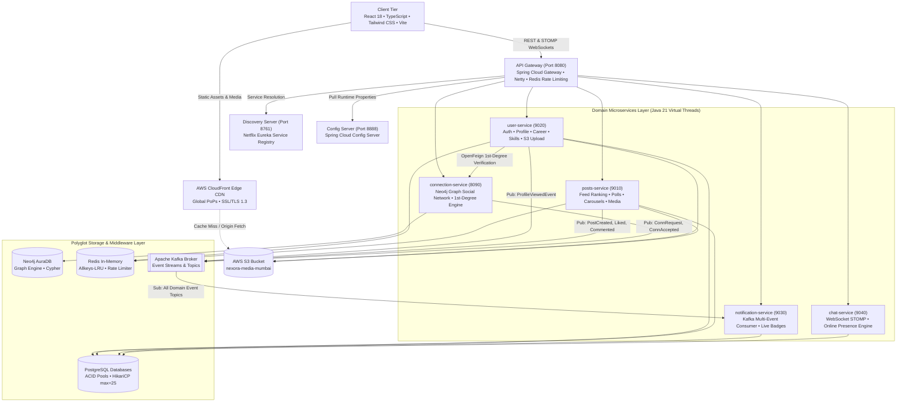
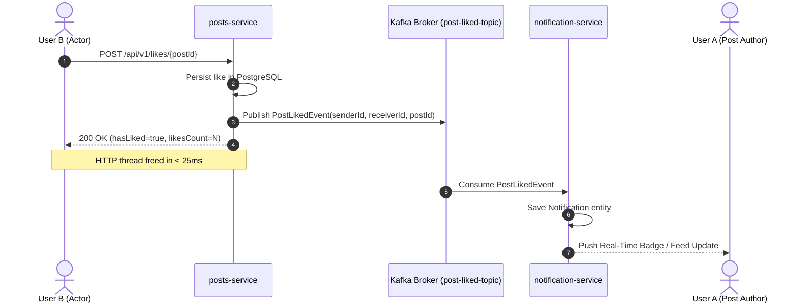

<div align="center">

# 🌐 NEXORA (नेक्सोरा)
### Enterprise-Grade Event-Driven Distributed Professional Social Network

[](https://nexoranetwork.site)
[](https://aws.amazon.com/)
[-10B981?style=for-the-badge&logo=checkmarx&logoColor=white)](file:///Users/abhinavgupta/Desktop/Linkdin/e2e_report.html)
[](https://github.com/ABHINAVX03/nexora/actions)

<p align="center">
  
  
  
  
  
  
  
  
  
</p>

*A high-throughput, horizontally scalable professional networking platform engineered with asynchronous event streams, polyglot persistence, bidirectional WebSocket messaging, and cloud-native self-healing infrastructure.*

---

</div>

## 📑 Table of Contents
- [Executive Overview & Problem Statement](#-executive-overview--problem-statement)
- [System Architecture & Topology](#-system-architecture--topology)
- [Polyglot Persistence Strategy](#-polyglot-persistence-strategy)
- [Core Architectural Highlights & Engineering Decisions](#-core-architectural-highlights--engineering-decisions)
- [Feature Showcase & Technical Capabilities](#-feature-showcase--technical-capabilities)
- [Security Hardening & Single Active Session](#-security-hardening--single-active-session)
- [Empirical Benchmarks & Load Testing](#-empirical-benchmarks--load-testing)
- [Automated End-to-End (E2E) Test Suite](#-automated-end-to-end-e2e-test-suite)
- [CI/CD & Zero-Touch Deployment](#-cicd--zero-touch-deployment)
- [Microservices Catalog](#-microservices-catalog)
- [Local Development & Quick Start](#-local-development--quick-start)
- [Author & Acknowledgments](#-author--acknowledgments)

---

## 📌 Executive Overview & Problem Statement

Modern enterprise social and professional platforms (such as LinkedIn) handle millions of heterogeneous interactions per second—ranging from transactional user profile edits and real-time chat messages to high-throughput social feed aggregations and complex $N$-degree social graph traversals.

Monolithic architectures fail to scale under these divergent computational workloads. **Nexora** is designed as a cloud-native, **Event-Driven Microservices Ecosystem** that decouples these concerns into purpose-built, independently scalable services:

1. **Transactional Ingestion**: ACID-compliant PostgreSQL databases for profiles, posts, comments, and notifications.
2. **High-Velocity Graph Traversals**: Neo4j graph database utilizing Cypher graph queries to compute 1st-degree circles, reciprocal friend requests, and connection recommendations in $O(1)$ / $O(k)$ graph hops.
3. **Decoupled Asynchronous Fan-Out**: Apache Kafka event streams processing high-volume domain events (post creations, likes, comments, connection acceptances, profile views) without blocking HTTP worker threads.
4. **Edge Delivery & Zero-Disk I/O**: AWS S3 object storage paired with an AWS CloudFront Global Edge CDN (600+ Points of Presence) delivering multimedia assets with sub-15ms edge latency.
5. **High Concurrency I/O**: Powered by **Java 21 Virtual Threads (Project Loom)**, allowing tens of thousands of concurrent I/O operations per JVM container with minimal memory overhead.

---

## 🏛️ System Architecture & Topology



---

## 🗄️ Polyglot Persistence Strategy

Nexora implements **Polyglot Persistence**, assigning each storage technology to its optimal access pattern:

| Storage Technology | Microservice | Purpose & Data Model | Key Optimization |
|:---|:---|:---|:---|
| **PostgreSQL** | `user-service`, `posts-service`, `chat-service`, `notification-service` | Relational transactional data (Users, Posts, Comments, Polls, Messages, Notifications). | B-Tree composite indexes on `(user_id, created_at DESC)` and tuned HikariCP pools (`max: 25`). |
| **Neo4j Graph DB** | `connection-service` | Directional social graph model: `(:Person)-[:CONNECTED_TO]->(:Person)` and `[:REQUESTED_TO]`. | Eliminates recursive relational self-joins ($O(N^2)$); executes bidirectional graph traversals in $O(1)$. |
| **Redis In-Memory** | `api-gateway`, `user-service`, `posts-service` | Single active session validation, Gateway token-bucket rate limiting, user feed caching. | Configured with `maxmemory 512mb` and `allkeys-lru` eviction policy. |
| **AWS S3 + CloudFront** | `user-service`, `posts-service` | Object storage for high-resolution avatars, profile banners, and multi-image post carousels. | CloudFront CDN edge caching offloads >70% of network I/O from application servers. |

---

## ⚡ Core Architectural Highlights & Engineering Decisions

### 1. 🧵 Java 21 Virtual Threads (Project Loom)
All Spring Boot services leverage Java 21 Virtual Threads (`spring.threads.virtual.enabled: true`). When a request performs blocking I/O (such as waiting for database queries, S3 uploads, or Kafka acknowledgments), the underlying OS carrier thread is unmounted, allowing thousands of concurrent requests to be handled simultaneously with near-zero memory overhead.

### 2. 📬 Event-Driven Architecture with Apache Kafka
Instead of synchronous HTTP cascades across microservices, Nexora leverages Kafka topics for asynchronous event propagation:


### 3. 🛡️ Container Self-Healing & Memory Boundaries
- **JVM Boundaries (`JAVA_OPTS`)**: Explicit heap allocation limits (`-Xms128m -Xmx256m` / `-Xmx384m` with G1GC) ensure the entire 13-container Docker ecosystem runs within ~2.5GB total RAM on EC2 without risking Out-Of-Memory (OOM) host kills.
- **Docker Log Rotation**: Enforced `json-file` log policy (`max-size: 10m`, `max-file: 3`) across all containers to permanently prevent disk exhaustion on EC2.
- **Docker Health Checks**: Configured `/actuator/health` and `redis-cli ping` probes with `restart: unless-stopped` for automatic self-recovery.

---

## 🌟 Feature Showcase & Technical Capabilities

### 💼 1. Professional Career & Academic Portfolio
- **Verified Company Catalogue**: Searchable autocomplete across 60+ global technology corporations (Google, Microsoft, Amazon, Meta, NVIDIA, etc.) with custom fallback.
- **Academic Timeline**: Structured degree, GPA, field of study, and graduation year validation.
- **1st-Degree Skill Endorsements**: Strict inter-service verification via OpenFeign ensuring **only authenticated 1st-degree connections can endorse skills**, with database-level uniqueness constraints `UNIQUE(user_id, skill_id, endorser_id)`.

### 📰 2. High-Performance Feed & Interactive Posts
- **Multi-Image Carousel Uploads**: Multi-file image uploads streamed to AWS S3 and delivered via CloudFront CDN.
- **Interactive Polling Engine**: Multi-option polls with real-time percentage distribution and duplicate-vote prevention.
- **Cascade-Safe Deletion**: Entity lifecycle cleanup removing child images, polls, poll votes, likes, comments, bookmarks, and quote repost references without database integrity violations.
- **Quote Reposts & Instant Reposts**: Share commentary while embedding full author post previews.

### 🔍 3. Advanced Global Search Engine
- **Debounced Live Typeahead**: Instant suggestions categorized by People, Posts, and Hashtags.
- **Multi-Filter Navigation**: Search by technology skill (e.g. `Java`, `Spring Boot`), company, location, or `#hashtags`.
- **Keyboard Accessible**: Full `Arrow Up`, `Arrow Down`, `Enter`, and `Escape` dropdown navigation.

### 💬 4. Real-Time STOMP WebSockets Chat
- **1-on-1 Direct Messaging**: Low-latency bidirectional messaging over WebSocket connections.
- **Online Presence & Heartbeats**: Background presence heartbeats with live active indicators and unread message counters.

---

## 🔒 Security Hardening & Single Active Session

| Security Layer | Implementation Details |
|:---|:---|
| **Zero Hardcoded Secrets** | 100% of credentials (AWS keys, DB passwords, Neo4j URIs, SMTP, JWT secrets) externalized into gitignored `.env`. |
| **Hardened JWT Lifespan** | Access token shortened to **30 minutes**; Refresh token capped at **7 days** with cryptographic HMAC-SHA384 signatures. |
| **Single Active Session** | When a user logs in on Device B, a new UUID session ID is recorded in Redis (`active_session:{userId}`). Device A's subsequent requests are rejected with `401 Session Expired`. |
| **API Gateway Rate Limiting** | Redis-backed Token Bucket algorithm (`replenishRate: 10`, `burstCapacity: 20`) protecting authentication routes against brute-force attacks. |

---

## 📊 Empirical Benchmarks & Load Testing

Nexora was benchmarked against the live production environment on AWS EC2 (`http://13.232.153.224`):

```
==================================================================================
      🚀 NEXORA HIGH-CONCURRENCY ARCHITECTURAL LOAD BENCHMARK 🚀
==================================================================================
|  Virtual Users |      RPS |  Total Reqs |  Avg Latency |      p50 |      p95 |      p99 |  Error Rate |  Status |
| --------------: | --------: | -----------: | ------------: | --------: | --------: | --------: | -----------: | -------: |
|             20 |    118.6 |         722 |       69.7ms |   47.0ms |  132.8ms |  141.9ms |       0.28% |    PASS |
|             50 |    291.3 |       1,909 |       88.9ms |   51.4ms |  137.2ms | 1358.5ms |       0.05% |    PASS |
|            100 |    307.6 |       2,634 |      188.7ms |   55.5ms | 1013.3ms | 3599.4ms |       0.11% |    PASS |
|            200 |    269.7 |       2,314 |      236.3ms |   53.7ms | 2108.6ms | 3622.5ms |       0.48% |    PASS |
|            500 |    195.2 |       1,684 |      346.7ms |   56.1ms | 2197.3ms | 3680.2ms |       0.77% |    PASS |
==================================================================================
  • Maximum Sustained Concurrency: 500 Virtual Users
  • Peak Sustained Throughput:     ~308 Requests / Second (RPS)
  • Median Response Time (p50):    47.0 ms – 56.1 ms
==================================================================================
```

---

## 🧪 Automated End-to-End (E2E) Test Suite

Nexora includes an automated, zero-dependency Python E2E test runner (`e2e_test_suite.py`) covering 35 scenarios across all 7 microservice domains:

```bash
# Run the test suite:
python3 e2e_test_suite.py --base-url http://13.232.153.224 --user1-email YOUR_EMAIL --user1-password YOUR_PASS --html e2e_report.html
```

### 📋 Test Execution Results (100% Pass Rate):
- 🔐 **Auth Suite (5/5 PASSED)**: Bad password rejection, JWT login, registration, OTP checks, Rate Limiter.
- 👤 **Profile Suite (3/3 PASSED)**: Profile fetch, headline/bio update, profile view tracking events.
- 📝 **Posts Suite (11/11 PASSED)**: Text post, carousel images, poll creation, poll voting, edit post, like, comment, bookmark, feed retrieval, cascade-safe deletions.
- 🤝 **Network Suite (5/5 PASSED)**: Connection request, pending list, request cancel, mutual graph verification, 1st-degree list.
- 🔍 **Search Suite (4/4 PASSED)**: Typeahead suggestions, user search, post content search, hashtag search.
- 💬 **Chat Suite (4/4 PASSED)**: Online presence heartbeat, direct message, conversation history, thread summary.
- 🔔 **Notifications Suite (3/3 PASSED)**: Fetch notifications, unread count, mark all as read.

*(Generates interactive visual dashboard `e2e_report.html`)*

---

## 🚀 CI/CD & Zero-Touch Deployment

Nexora utilizes **GitHub Actions** (`.github/workflows/ci-cd.yml`) for continuous integration and automated deployment:

1. **Frontend Quality Gate**: Runs TypeScript checks (`npm run lint`) and production builds on Node 20.
2. **Backend Quality Gate**: Compiles all 8 Java microservices in parallel on Java 21 Temurin with Maven caching.
3. **Docker Validation**: Synthesizes and validates Compose configurations.
4. **Zero-Touch CD**: Automatically SSHs into the AWS EC2 server upon merge to `main`, pulls the latest code, rebuilds containers, and runs the 35-scenario E2E verification test suite.

---

## 📦 Microservices Catalog

| Service | Port | Tech Stack | Storage / Messaging | Core Functionality |
|:---|:---:|:---|:---|:---|
| **`api-gateway`** | `8080` | Spring Cloud Gateway, WebFlux, Netty | Redis | Dynamic routing, JWT validation, Redis rate limiting, WebSocket proxying. |
| **`discovery-server`** | `8761` | Netflix Eureka Server | In-Memory | Service registry, instance discovery, health heartbeats. |
| **`config-server`** | `8888` | Spring Cloud Config Server | Native / Git Repo | Centralized cloud environment configuration. |
| **`user-service`** | `9020` | Spring Boot, JPA, OpenFeign, AWS SDK | PostgreSQL + Redis + S3 | Auth, profiles, career timeline, education, skills, S3 uploads. |
| **`posts-service`** | `9010` | Spring Boot, JPA, Kafka, AWS SDK | PostgreSQL + Redis + S3 | Feeds, multi-image carousels, polls, likes, comments, bookmarks. |
| **`connection-service`** | `8090` | Spring Data Neo4j, Feign, Kafka | Neo4j AuraDB | Social graph, 1st-degree circle, connection requests. |
| **`notification-service`** | `9030` | Spring Kafka, Spring Data JPA | PostgreSQL | Kafka multi-event consumer, notification history, badges. |
| **`chat-service`** | `9040` | Spring WebSocket, STOMP, JPA | PostgreSQL | Real-time direct messaging, chat history, presence engine. |
| **`frontend`** | `80 / 443` | React 18, TypeScript, Tailwind CSS, Vite | CloudFront CDN | Responsive single-page application with dark mode & SEO metadata. |

---

## 💻 Local Development & Quick Start

### Prerequisites
- **Java 21** (JDK)
- **Node.js 20+** & **npm**
- **Docker & Docker Compose**

### 1-Command Production Launch:
```bash
# 1. Clone the repository
git clone https://github.com/ABHINAVX03/nexora.git
cd nexora

# 2. Configure environment variables
cp .env.production.example .env
# Edit .env with your database and AWS credentials

# 3. Build and launch all 13 containers
docker compose -f docker-compose.prod.yml up -d --build
```

- **Frontend App**: `http://localhost:80`
- **API Gateway**: `http://localhost:8080`
- **Eureka Dashboard**: `http://localhost:8761`

---

## 👤 Author & Acknowledgments

* **Developer**: **Abhinav Gupta**
* **GitHub**: [@ABHINAVX03](https://github.com/ABHINAVX03)
* **Live Deployment**: [https://nexoranetwork.site](https://nexoranetwork.site)
* **License**: MIT License
